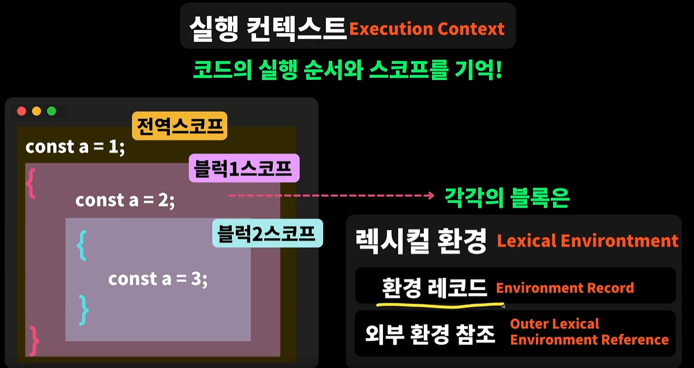
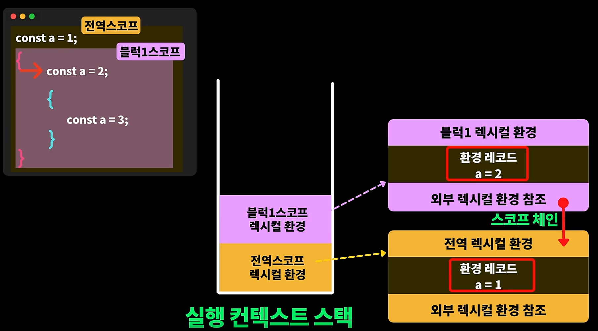

# 실행컨텍스트와 렉시컬 환경

1. 각각의 코드블럭은 렉시컬 환경이라는 내부 오브젝트를 가지고 있음
2. 쉽게 말해서, 어떠한 코드 블럭도 블럭안에 선언된 변수와 각각의 정보(근접한 부모는 누구인가? 등등..)를 가지고 있는 오브젝트가 있음
3. 그러한 오브젝트들을 렉시컬 환경이라고 부르는 것
4. 렉시컬 환경 안에는 대표적으로 두가지가 있음.
   - 현재 블록에 해당하는 정보를 담고 있는 환경 레코드,
   - 현재 블록의 부모는 누구인지, 그 부모를 참조하고 있는 외부환경참조가 있다.

