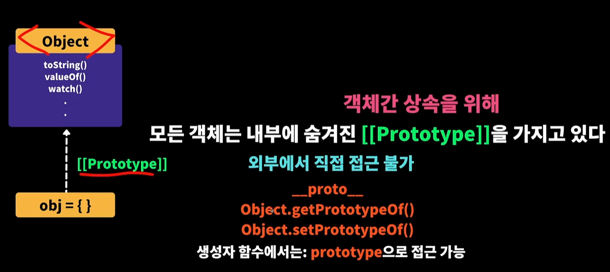
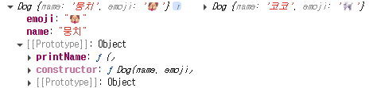
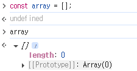
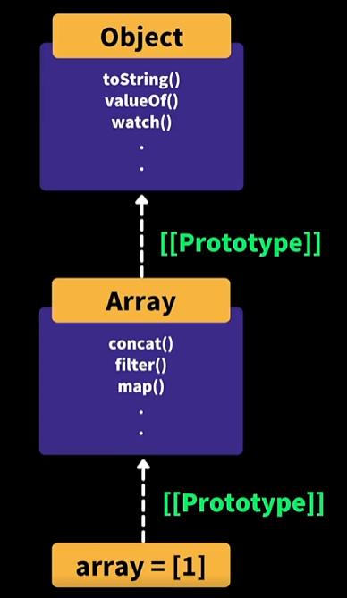

# 프로토타입

1. js에서 모든 객체들은 오브젝트라는 프로토타입을 가지고 있음

   - 즉, js에서 객체라면 공통적으로 가지고 있는 속성들, 함수들을 묶어놓은 원형인 Object라는 이름을 가진 프로토타입을 가지고 있음.
   - 따라서 모든 객체는 내부에 숨겨진 [[Prototype]]을 가지고 있음.
   - 왜? 객체에서 공통적으로 사용되는 함수를 쉽게 상속하기 위해서
   - 실제로 빈 오브젝트 생성 후 . 을 찍어보면 다양한 객체 속성들이 있는 것을 확인 할 수 있다.
     

2. 모든 js 객체들은 개별적인 오브젝트 프로토타입을 상속하는 것이 아닌, 동일한 하나의 오브젝트 프로젝트를 상속받는 것을 알 수 있다.
   

```js
obj1.__proto__ === obj2.__proto__;
// 결과 : true
```

3. 같은 맥락에서 빈 배열 생성후 콘솔에 찍어보면 [[araay]]라는 프로토타입을 상속받는 것을 알 수 있음

   - 따라서 모든 배열에서 다양한 배열 속성 및 함수를 쉽게 사용할 수 있는것이다.(ex, map filter 매서드 등등..)
   - 배열 프로토타입을 잘 보면 Object 프로토타입을 상속받는다.
     - 그래서 배열에서 toString 등의 객체 프로토타입 매서드를 사용할 수 있는것.
   - 그래서 무엇을 알 수 있나?
     - 객체간 상속의 연결고리는 **프로토타입 체인**으로 연결되어 있는 것을 알 수 있다.
       
       

4. 사용자 정의 프로토타입을 만들어 줄 수도 있다.

```js
function Dog(name, emoji) {
  this.name = name;
  this.emoji = emoji;
}

Dog.prototype.printName = function () {
  console.log(`${this.name} ${this.emoji}`);
};

const dog1 = new Dog('뭉치', '🐶');
const dog2 = new Dog('코코', '🐩');

console.log(dog1, dog2);
```


