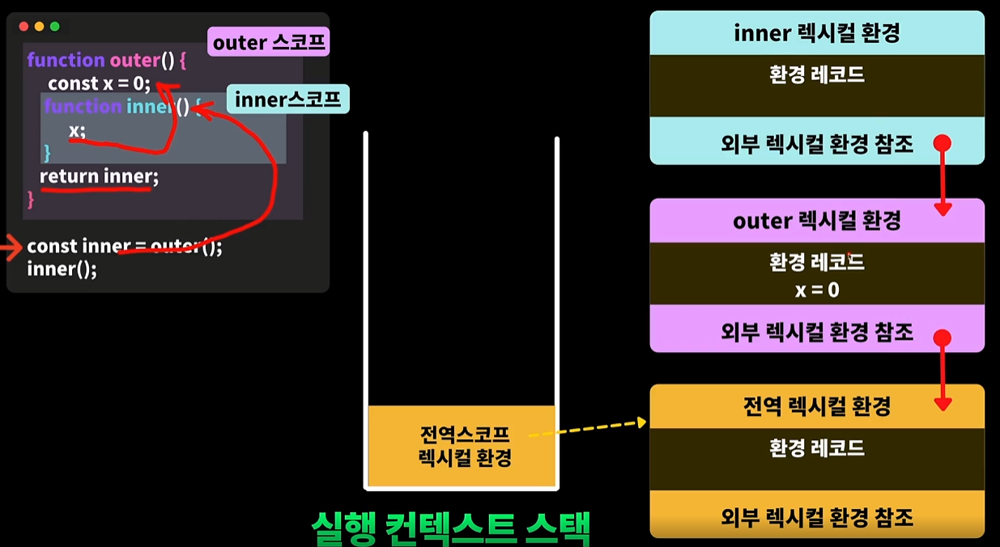

# 클로저란

1. 함수와 그 외부를 둘러싸고 있는 렉시컬 환경의 조합이다.
2. 즉, 내부 스코프 함수에서 외부 스코프 함수에 접근할 수 있는 권한.
   
3. 클로저의 주요 목적?
   - 내부 정보를 보호하고, 공개 함수를 통한 데이터 조작을 위해 사용됨
   - 즉, 캡슐화와 정보 은닉을 위해 사용된다.
   - private 필드 또는 매소드를 사용하는 효과와 동일
